# 🗄️ Database Entity-Relationship (ER) Diagram & Schema Documentation

## 1. Visual Entity-Relationship (ER) Diagram (Mermaid)

```mermaid
erDiagram
    %% ==========================================
    %% ACADEMIC STRUCTURE CLUSTER
    %% ==========================================
    departments ||--o{ subjects : "has / offers (1:N)"
    departments ||--o{ vision_missions : "defines (1:N)"
    years ||--o{ semesters : "divided into (1:N)"
    subjects ||--o{ courses : "taught in (1:N)"
    semesters ||--o{ courses : "scheduled for (1:N)"

    departments {
        int id PK "Auto Increment"
        varchar_100 department_name UK "Unique"
    }

    vision_missions {
        int id PK "Auto Increment"
        text vision "Vision statement"
        text mission "Mission statement"
        int department_id FK "References departments.id (CASCADE)"
        varchar_20 language "Default: en"
    }

    subjects {
        int id PK "Auto Increment"
        varchar_200 subject_code "Subject Code"
        varchar_200 subject_name "Subject Name"
        varchar_200 description "Brief Description"
        int department_id FK "References departments.id (CASCADE)"
    }

    years {
        int id PK "Auto Increment"
        varchar_100 year_name UK "e.g., First Year, Second Year"
    }

    semesters {
        int id PK "Auto Increment"
        varchar_100 semester_name UK "e.g., First Semester"
        varchar_100 semester_term UK "e.g., 1st Sem"
        int year_id FK "References years.id (CASCADE)"
    }

    courses {
        int id PK "Auto Increment"
        varchar_100 course_id "Course Identifier Code"
        varchar_200 course_name "Full Course Name"
        int subject_id FK "References subjects.id (CASCADE)"
        int semester_id FK "References semesters.id (CASCADE)"
    }

    %% ==========================================
    %% CAMPUS SHOWCASE & CONTENT CLUSTER
    %% ==========================================
    activities {
        int id PK "Auto Increment"
        text activity_name "Activity Title/Name"
        varchar_100 category "Activity Category"
        text description "Event Details"
        varchar_100 activity_type "Default: Activity"
        varchar_225 filename UK "Image File Name"
        varchar_225 filepath UK "Relative Path"
        date date "Event Date"
    }

    laboratories {
        int id PK "Auto Increment"
        varchar_100 laboratory_name "Lab Name"
        varchar_100 category "Lab Category"
        text description "Lab Details"
        varchar_225 filename UK "Image File Name"
        varchar_225 filepath UK "Relative Path"
        date date "Established / Log Date"
    }

    researches {
        int id PK "Auto Increment"
        varchar_100 research_name "Paper / Project Title"
        varchar_100 category "Research Domain"
        text description "Abstract / Details"
        varchar_225 filename UK "Attached Document / Media"
        varchar_225 filepath UK "Relative Path"
        date date "Publication Date"
    }

    collabroations {
        int id PK "Auto Increment"
        varchar_200 logo "Partner Logo Path"
        varchar_200 organization_name "Organization Name"
        varchar_200 collaboration_type "Default: partner / company / university"
        text description "Collaboration Scope"
        varchar_200 url "Partner Website Link"
    }

    academic_calendars {
        int id PK "Auto Increment"
        varchar_100 title "Schedule / Milestone Title"
        text description "Details"
        varchar_20 status "Pending / On Progress / Completed"
        date start_date "Start Date"
        date end_date "End Date"
    }

    %% ==========================================
    %% SYSTEM, ADMIN & METRICS CLUSTER
    %% ==========================================
    users {
        int id PK "Auto Increment"
        varchar_50 user_id UK "Unique User Identifier"
        varchar_50 user_name UK "Username"
        varchar_150 user_email UK "User Email"
        text user_password "Hashed Password"
        varchar_255 user_avatar "Avatar Image Filename"
        datetime created_at "Record Creation Time"
        datetime updated_at "Last Profile Update"
    }

    dashboards {
        int id PK "Auto Increment"
        varchar_100 attr_key UK "Config Key (e.g. Rector's Message, Topbar)"
        text value "Attribute Value / Content"
        text file "Optional Attached File Path"
    }

    counts {
        int id PK "Auto Increment"
        int total_student "Total Student Population"
        int total_staff "Total Faculty & Staff"
        int graduated_student "Total Alumni / Graduates"
        int current_student "Currently Enrolled Students"
    }

    settings {
        int id PK "Auto Increment"
        boolean app_installed "Installation Flag"
    }
```



---

## 2. Logical Functional Clusters

The 15 database tables in `app/models/` are divided into **three functional domains**:

```
┌────────────────────────────────────────────────────────────────────────────────────────┐
│ 1. ACADEMIC CURRICULUM CLUSTER                                                         │
│                                                                                        │
│   [departments] ──(1:N)──► [subjects] ──(1:N)──┐                                      │
│         │                                      ▼                                      │
│       (1:N)                                [courses] ◄──(N:1)── [semesters] ◄──(N:1)── [years]
│         ▼                                                                              │
│   [vision_missions]                                                                    │
└────────────────────────────────────────────────────────────────────────────────────────┘

┌────────────────────────────────────────────────────────────────────────────────────────┐
│ 2. CAMPUS LIFE, SHOWCASE & PUBLIC PORTAL CLUSTER                                       │
│                                                                                        │
│   • [activities]          - Campus events, student activities, and photo galleries    │
│   • [laboratories]        - Hardware/Software lab facilities and technical specs       │
│   • [researches]          - Faculty & student research publications, papers           │
│   • [collabroations]      - Industry and international university partners             │
│   • [academic_calendars]  - University academic dates, semester terms, and milestones  │
└────────────────────────────────────────────────────────────────────────────────────────┘

┌────────────────────────────────────────────────────────────────────────────────────────┐
│ 3. SYSTEM ADMINISTRATION, SECURITY & METRICS CLUSTER                                   │
│                                                                                        │
│   • [users]               - Admin credentials, authentication hashes, user avatars     │
│   • [dashboards]          - Dynamic portal settings (Rector Message, Topbar, Notices) │
│   • [counts]              - Key university statistics counter metrics                  │
│   • [settings]            - System installation status and setup lock                  │
└────────────────────────────────────────────────────────────────────────────────────────┘
```

---

## 3. Detailed Data Dictionary (Table Specifications)

### 3.1. Academic Cluster

#### `departments` (Model: `Department`)
| Column | Type | Constraints | Description |
| :--- | :--- | :--- | :--- |
| `id` | `INTEGER` | `PRIMARY KEY`, `AUTO_INCREMENT` | Unique department ID |
| `department_name` | `VARCHAR(100)` | `UNIQUE`, `NOT NULL` | Name of academic department |

#### `subjects` (Model: `Subject`)
| Column | Type | Constraints | Description |
| :--- | :--- | :--- | :--- |
| `id` | `INTEGER` | `PRIMARY KEY`, `AUTO_INCREMENT` | Unique subject ID |
| `subject_code` | `VARCHAR(200)` | `NULLABLE` | Academic subject code (e.g. CST-101) |
| `subject_name` | `VARCHAR(200)` | `NOT NULL` | Full subject name |
| `description` | `VARCHAR(200)` | `NULLABLE` | Subject description |
| `department_id` | `INTEGER` | `FOREIGN KEY` $\rightarrow$ `departments.id` (`ON DELETE CASCADE`) | Department owning this subject |

#### `years` (Model: `Year`)
| Column | Type | Constraints | Description |
| :--- | :--- | :--- | :--- |
| `id` | `INTEGER` | `PRIMARY KEY`, `AUTO_INCREMENT` | Unique year level ID |
| `year_name` | `VARCHAR(100)` | `UNIQUE`, `NOT NULL` | Academic year level (e.g. First Year, Final Year) |

#### `semesters` (Model: `Semester`)
| Column | Type | Constraints | Description |
| :--- | :--- | :--- | :--- |
| `id` | `INTEGER` | `PRIMARY KEY`, `AUTO_INCREMENT` | Unique semester ID |
| `semester_name` | `VARCHAR(100)` | `UNIQUE`, `NOT NULL` | Descriptive name (e.g. First Semester) |
| `semester_term` | `VARCHAR(100)` | `UNIQUE`, `NOT NULL` | Term identifier (e.g. 1st Sem) |
| `year_id` | `INTEGER` | `FOREIGN KEY` $\rightarrow$ `years.id` (`ON DELETE CASCADE`) | Parent academic year |

#### `courses` (Model: `Course`)
| Column | Type | Constraints | Description |
| :--- | :--- | :--- | :--- |
| `id` | `INTEGER` | `PRIMARY KEY`, `AUTO_INCREMENT` | Unique course offering ID |
| `course_id` | `VARCHAR(100)` | `NOT NULL` | Course offering code |
| `course_name` | `VARCHAR(200)` | `NOT NULL` | Full course title |
| `subject_id` | `INTEGER` | `FOREIGN KEY` $\rightarrow$ `subjects.id` (`ON DELETE CASCADE`, `INDEX`) | Subject syllabus reference |
| `semester_id` | `INTEGER` | `FOREIGN KEY` $\rightarrow$ `semesters.id` (`ON DELETE CASCADE`, `INDEX`) | Semester schedule reference |

#### `vision_missions` (Model: `VisionMission`)
| Column | Type | Constraints | Description |
| :--- | :--- | :--- | :--- |
| `id` | `INTEGER` | `PRIMARY KEY`, `AUTO_INCREMENT` | Record ID |
| `vision` | `TEXT` | `NOT NULL` | Vision statement text |
| `mission` | `TEXT` | `NOT NULL` | Mission statement text |
| `department_id` | `INTEGER` | `FOREIGN KEY` $\rightarrow$ `departments.id` (`ON DELETE CASCADE`) | Department reference |
| `language` | `VARCHAR(20)` | `NOT NULL`, `DEFAULT 'en'` | Language code (`en` or `mm`) |

---

### 3.2. Campus Life & Showcase Cluster

#### `activities` (Model: `Activity`)
| Column | Type | Constraints | Description |
| :--- | :--- | :--- | :--- |
| `id` | `INTEGER` | `PRIMARY KEY`, `AUTO_INCREMENT` | Unique activity image/record ID |
| `activity_name` | `TEXT` | `NOT NULL` | Title of activity |
| `category` | `VARCHAR(100)` | `NULLABLE` | Activity category |
| `description` | `TEXT` | `NULLABLE` | Detailed description |
| `activity_type` | `VARCHAR(100)` | `NOT NULL`, `DEFAULT 'Activity'` | Type classifier |
| `filename` | `VARCHAR(225)` | `UNIQUE`, `NULLABLE` | Media file name |
| `filepath` | `VARCHAR(225)` | `UNIQUE`, `NULLABLE` | Relative path in `/media/activities/` |
| `date` | `DATE` | `NOT NULL` | Event occurrence date |

#### `laboratories` (Model: `Laboratory`)
| Column | Type | Constraints | Description |
| :--- | :--- | :--- | :--- |
| `id` | `INTEGER` | `PRIMARY KEY`, `AUTO_INCREMENT` | Lab ID |
| `laboratory_name` | `VARCHAR(100)` | `NOT NULL` | Laboratory name |
| `category` | `VARCHAR(100)` | `NULLABLE` | Lab category / discipline |
| `description` | `TEXT` | `NULLABLE` | Equipment & description |
| `filename` | `VARCHAR(225)` | `UNIQUE`, `NOT NULL` | Photo filename |
| `filepath` | `VARCHAR(225)` | `UNIQUE`, `NOT NULL` | Relative path in `/media/laboratories/` |
| `date` | `DATE` | `NOT NULL` | Date recorded |

#### `researches` (Model: `Research`)
| Column | Type | Constraints | Description |
| :--- | :--- | :--- | :--- |
| `id` | `INTEGER` | `PRIMARY KEY`, `AUTO_INCREMENT` | Research paper ID |
| `research_name` | `VARCHAR(100)` | `NOT NULL` | Paper / project title |
| `category` | `VARCHAR(100)` | `NULLABLE` | Research field |
| `description` | `TEXT` | `NULLABLE` | Abstract / summary |
| `filename` | `VARCHAR(225)` | `UNIQUE`, `NOT NULL` | Cover/document filename |
| `filepath` | `VARCHAR(225)` | `UNIQUE`, `NOT NULL` | Path in `/media/researches/` |
| `date` | `DATE` | `NOT NULL` | Publication date |

#### `collabroations` (Model: `Collaboration`)
| Column | Type | Constraints | Description |
| :--- | :--- | :--- | :--- |
| `id` | `INTEGER` | `PRIMARY KEY`, `AUTO_INCREMENT` | Partner ID |
| `logo` | `VARCHAR(200)` | `NOT NULL` | Logo image filename |
| `organization_name` | `VARCHAR(200)` | `NOT NULL` | Organization name |
| `collaboration_type` | `VARCHAR(200)` | `NOT NULL`, `DEFAULT 'partner'` | Type (`partner`, `company`, `university`) |
| `description` | `TEXT` | `NULLABLE` | Memorandum / partnership details |
| `url` | `VARCHAR(200)` | `NULLABLE` | External link |

#### `academic_calendars` (Model: `AcademicCalendar`)
| Column | Type | Constraints | Description |
| :--- | :--- | :--- | :--- |
| `id` | `INTEGER` | `PRIMARY KEY`, `AUTO_INCREMENT` | Event ID |
| `title` | `VARCHAR(100)` | `NULLABLE` | Milestone title |
| `description` | `TEXT` | `NULLABLE` | Milestone description |
| `status` | `VARCHAR(20)` | `NOT NULL`, `DEFAULT 'Pending'` | Status (`Pending`, `On Progress`, `Completed`) |
| `start_date` | `DATE` | `NOT NULL` | Schedule start date |
| `end_date` | `DATE` | `NOT NULL` | Schedule end date |

---

### 3.3. System, Admin & Metrics Cluster

#### `users` (Model: `User`)
| Column | Type | Constraints | Description |
| :--- | :--- | :--- | :--- |
| `id` | `INTEGER` | `PRIMARY KEY`, `AUTO_INCREMENT` | Internal user ID |
| `user_id` | `VARCHAR(50)` | `UNIQUE`, `NOT NULL` | Custom identifier (e.g. `USR-001`) |
| `user_name` | `VARCHAR(50)` | `UNIQUE`, `NOT NULL` | Login username |
| `user_email` | `VARCHAR(150)` | `UNIQUE`, `NOT NULL` | Admin email address |
| `user_password` | `TEXT` | `NOT NULL` | Cryptographically hashed password |
| `user_avatar` | `VARCHAR(255)` | `NOT NULL`, `DEFAULT '3d-avatar-1.avif'` | Avatar image file |
| `created_at` | `DATETIME` | `DEFAULT UTC` | Account creation timestamp |
| `updated_at` | `DATETIME` | `DEFAULT UTC`, `ON UPDATE UTC` | Last modification timestamp |

#### `dashboards` (Model: `Dashboard`)
| Column | Type | Constraints | Description |
| :--- | :--- | :--- | :--- |
| `id` | `INTEGER` | `PRIMARY KEY`, `AUTO_INCREMENT` | Record ID |
| `attr_key` | `VARCHAR(100)` | `UNIQUE`, `NOT NULL` | Key (`Rector's Message`, `School Open Date`, etc.) |
| `value` | `TEXT` | `NOT NULL` | Key value content |
| `file` | `TEXT` | `NULLABLE` | Optional associated document file path |

#### `counts` (Model: `Count`)
| Column | Type | Constraints | Description |
| :--- | :--- | :--- | :--- |
| `id` | `INTEGER` | `PRIMARY KEY`, `AUTO_INCREMENT` | Stats record ID |
| `total_student` | `INTEGER` | `NOT NULL` | Total university student count |
| `total_staff` | `INTEGER` | `NOT NULL` | Total university staff count |
| `graduated_student` | `INTEGER` | `NOT NULL` | Total graduated alumni |
| `current_student` | `INTEGER` | `NOT NULL` | Currently active enrolled students |

#### `settings` (Model: `Setting`)
| Column | Type | Constraints | Description |
| :--- | :--- | :--- | :--- |
| `id` | `INTEGER` | `PRIMARY KEY`, `AUTO_INCREMENT` | Setting ID |
| `app_installed` | `BOOLEAN` | `NOT NULL`, `DEFAULT FALSE` | First-time installation guard flag |

---

## 4. Foreign Key & Relationship Mapping

| Parent Entity | Child Entity | Foreign Key Column | Cardinality | Cascade Action |
| :--- | :--- | :--- | :--- | :--- |
| `departments` (`id`) | `subjects` | `subjects.department_id` | **1 : N** | `ON DELETE CASCADE` (`delete-orphan`) |
| `departments` (`id`) | `vision_missions` | `vision_missions.department_id` | **1 : N** | `ON DELETE CASCADE` (`delete-orphan`) |
| `years` (`id`) | `semesters` | `semesters.year_id` | **1 : N** | `ON DELETE CASCADE` (`delete-orphan`) |
| `subjects` (`id`) | `courses` | `courses.subject_id` | **1 : N** | `ON DELETE CASCADE` (`delete-orphan`) |
| `semesters` (`id`) | `courses` | `courses.semester_id` | **1 : N** | `ON DELETE CASCADE` (`delete-orphan`) |
